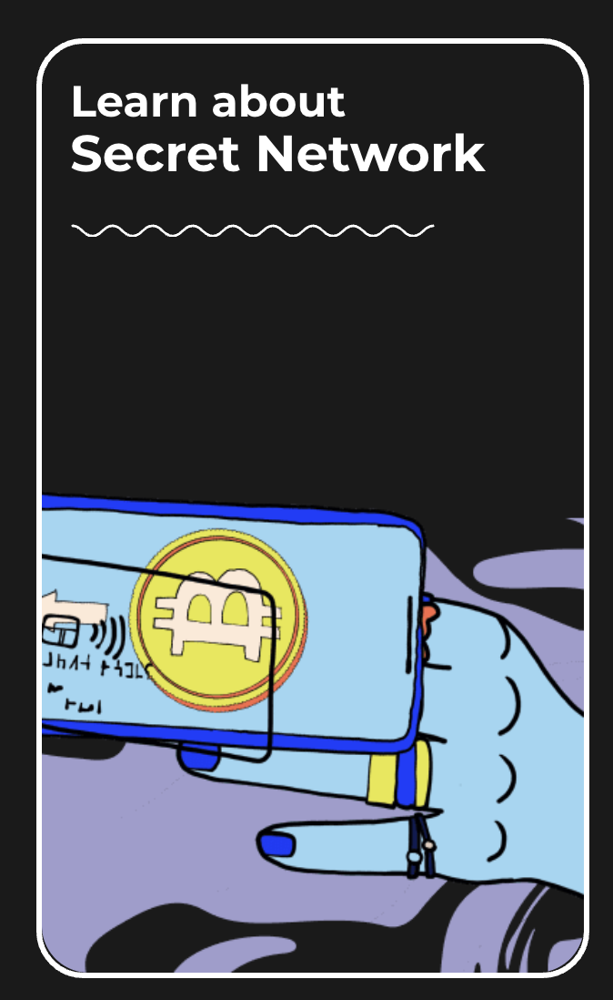

Welcome to the Secret Website Content Repository.

This Repository is a companion to the Secret Website Repository. Think of this as a sort of content management system or content database for the Secret Website.

Why is this seperated into a seperate repository?

There are a two reasons we made this choice:

#1 Seperation of Concerns: A traditional content based website like the Secret Network Website would have a content management system connected to a database. The CMS would be in charge the creating, updating and deleting from the database, while the site itself would read that content and render it to the vistor. The problem with this type of a system is overhead both in terms of management and cost. The Secret Website instead reads all data from Markdown files that each represent a page. By moving those files to a seperate repo, we are in essence, adding a content management system in the form of a github repository. Creating, updating and deleting are thus seperated from the website repo keeping the content management process in it's own world.

#2 Flexibility: With the seperation of concerns we gain flexibility that we didn't have before. We are able to use this repo as the single source of truth for multiple environments of the website itself. As a result we know that when we look at the development site, the content will be identical to production. If we want to we could create a content preview environment to view content changes ahead of release, or we could allow content to be updated in real time and fix errors through a crowdsource editing process. Both of these architectures, and many other, are possible now.

#3 Permissions: As we move forward we can be much more liberal with permissions allowing people to edit content without fear of effecting the core of the site architecture. We will be giving permissions to all commitee leads to start, but we expect that to expand as people more people show interest.

So now that I know the why, what about he how? How does one contribute to the content of the website?

Contributions can be handled in two ways, one fast and easy, the other more robust and controlled.

The first method is to just create, edit, or delete md files through the Github UI. To do this follow these steps.

Find the right file:
Files names are mapped to routes on the site. Thuse if you want to add to the https://scrt.network/brand page, you would edit brand.md in the root directory. Files with subroots, e.g. https://scrt.network/ecosystem/overview is located in the ecosystem folder in the file overview.md

Get comfortable with the format:
Although the files are .md files, they are not pure markdown. They contain references to components in the form of html tags. An example of this might look something like
```
<home-card to="/about/about-secret-network" vertical>
### **Learn about**<br>Secret Network
<separator small />

</home-card>
```

This renders a "home card" component that looks like this: 
